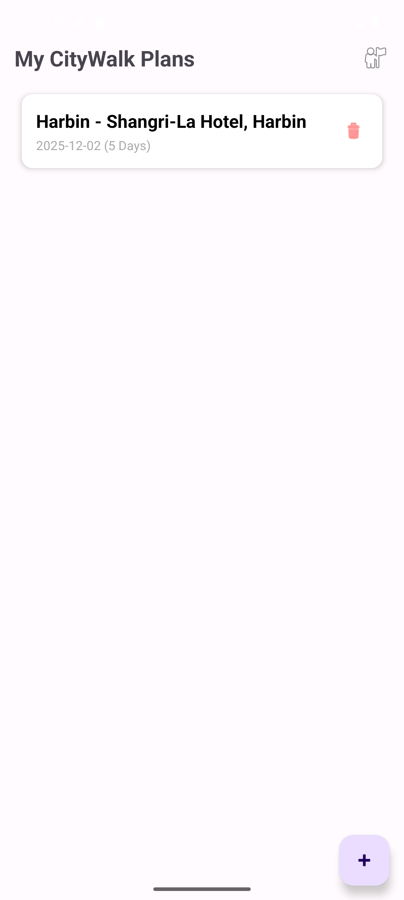
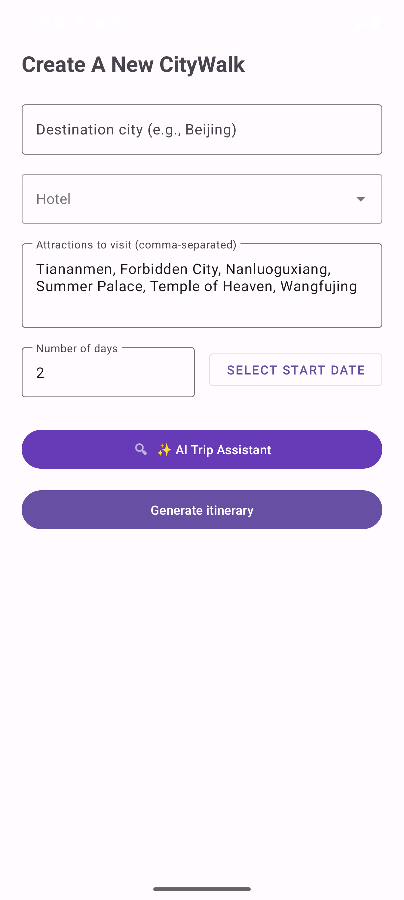
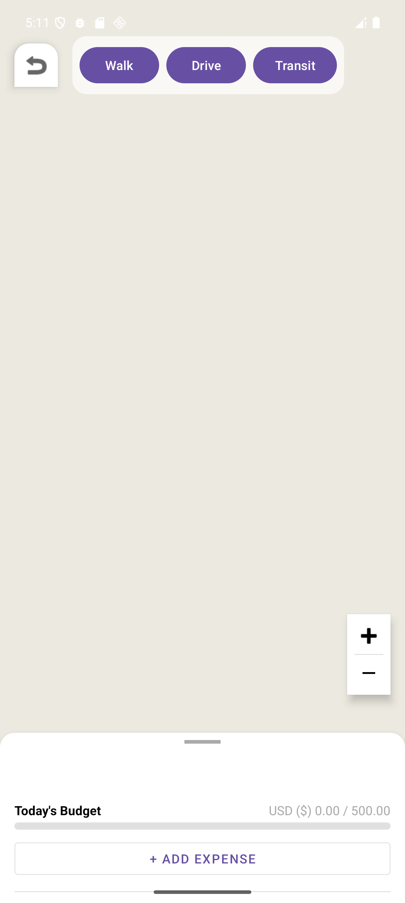
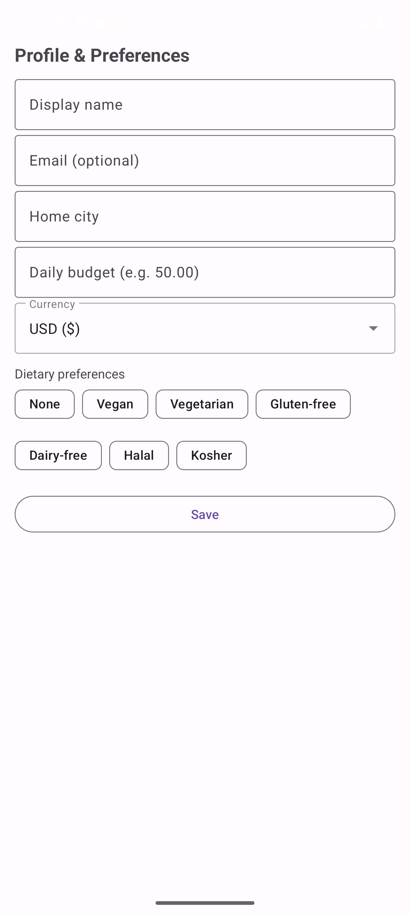

# CityGo - Smart Travel Companion

[Chinese README](./README_CN.md)

CityGo is an Android travel planning app for building city-walk itineraries. It combines a trip planner, Google Maps based navigation, AI-assisted itinerary generation, user travel preferences, and local budget tracking in one mobile workflow.

> Mobile Computing (COMP3011J) - Group 04 Project

## Screenshots

Screenshots below were captured from a local Android emulator run.

<table>
  <tr>
    <td align="center"><br>Trip list</td>
    <td align="center"><br>Create trip</td>
    <td align="center"><br>Map and budget</td>
    <td align="center"><br>Profile preferences</td>
  </tr>
</table>

## Features

- Create CityWalk plans with destination city, hotel, attraction list, start date, and trip duration.
- Generate itineraries with an AI trip assistant.
- Display map-based routes and switch between walking, driving, and transit modes.
- Track daily trip budget and add expenses during a trip.
- Store user profile details, dietary preferences, home city, currency, and daily budget.
- Persist trips, users, and expenses locally with Room.

## Tech Stack

- Language: Java
- Platform: Android
- Build system: Gradle / Android Gradle Plugin 8.13.1
- SDK: compileSdk 36, minSdk 24, targetSdk 36
- UI: AndroidX, Material Components, ViewBinding
- Maps and places: Google Maps SDK for Android, Google Places API, Google Maps Android Utils
- Storage: Room
- Animation: Lottie

## APK Download

A prebuilt APK is hosted externally:

[Download CityGo.apk from Google Drive](https://drive.google.com/file/d/17oRw_qTTKMSMIE5jjJ8eAfsoAA1IJME_/view?usp=drive_link)

## Local Setup

### Prerequisites

- Android Studio Ladybug/Koala or newer
- Android SDK Platform 36 installed
- JDK 11 or newer
- Android emulator or physical Android device with Google Play Services
- Google Maps Platform keys with the required APIs enabled:
  - Maps SDK for Android
  - Places API
  - Directions API
- DeepSeek API key if you want to use the AI itinerary assistant

### Clone and Build

```bash
git clone https://github.com/JojoZhu9/COMP3011J-CityGo.git
cd COMP3011J-CityGo
```

On Windows:

```powershell
.\gradlew.bat assembleDebug
```

On macOS/Linux:

```bash
./gradlew assembleDebug
```

The debug APK is generated at:

```text
app/build/outputs/apk/debug/app-debug.apk
```

### Android SDK Path

If Gradle cannot find the Android SDK, create a local-only `local.properties` file in the project root. This file is ignored by Git.

```properties
sdk.dir=C\:\\Users\\<your-user>\\AppData\\Local\\Android\\Sdk
```

### Install and Launch from the Command Line

```bash
adb install -r app/build/outputs/apk/debug/app-debug.apk
adb shell am start -n com.example.citygo/.LoginActivity
```

You can also open the project in Android Studio and use the normal Run button.

## API Key Notes

This app depends on Google Maps/Places/Directions services and an AI itinerary service. Use your own restricted keys before running or publishing a build.

- The map key is referenced from `app/src/main/res/values/google_maps_api.xml`.
- Places, route planning, and AI itinerary code also require valid service keys.
- Do not commit production secrets. Prefer ignored local configuration, Gradle properties, or CI secrets for real deployments.

## Verified Locally

- `.\gradlew.bat assembleDebug` completed successfully on Windows.
- The debug APK was installed and launched on the `Pixel_8_Pro_2` Android emulator.
- README screenshots were captured from that local run.

## Troubleshooting

- `SDK location not found`: add `local.properties` with your local Android SDK path.
- Blank map or `Locate Failed`: check emulator/device location permission, Google Play Services, internet access, and Google Maps API key restrictions.
- Gradle sync fails: confirm Android SDK Platform 36 is installed and Android Studio is using JDK 11+.
- AI itinerary generation fails: confirm the AI API key is valid and the device/emulator can reach the API endpoint.

## Project Structure

```text
app/src/main/java/com/example/citygo/
|-- LoginActivity.java
|-- PreferenceSelectionActivity.java
|-- MainActivity.java
|-- CreateTripActivity.java
|-- MapActivity.java
|-- ProfileActivity.java
|-- TripBudgetController.java
|-- RouteManager.java
|-- GoogleMapsService.java
`-- database/
```

## Contributors

| Name | Role | GitHub |
|:---:|:---:|:---:|
| Jiuzhou Zhu | Member | [@JojoZhu9](https://github.com/JojoZhu9) |
| Ciara Behan | Member | - |
| Eva Barrett | Member | - |

Copyright 2025 CityGo Project. All rights reserved.
